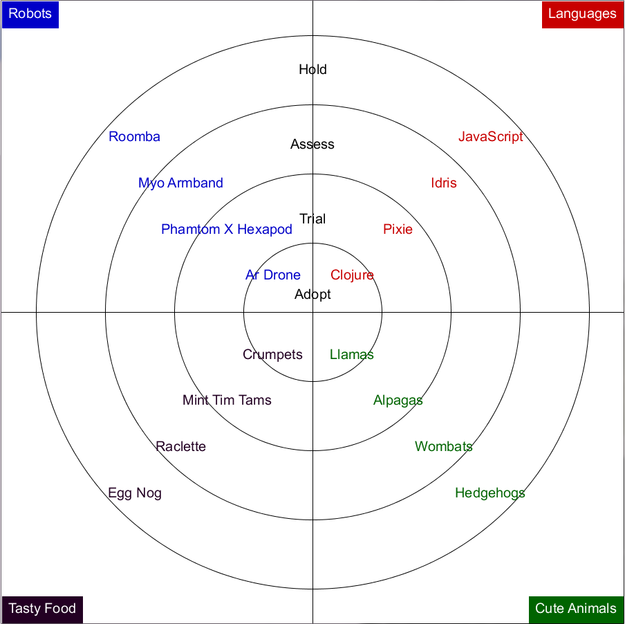

# Radar

Simple clojure application to draw a radar (idea from [gigaquid](http://gigasquidsoftware.com/blog/2014/12/17/gigasquids-radar-2014)).

## Installation

Download standalone jar from available [releases](https://github.com/thefourhorsemen/radar/releases).

## Usage

    $ java -jar radar-1.0.0.jar [filename]
where `filename` is the name of the configuration file, in JSON format.

## Examples

Hereafter is the gigasquid radar 2014 drawn with radar.



Here the content of the configuration leading to the sample radar above:
```json
[
  {
    "name": "Robots",
    "categories": [
      "Ar Drone",
      "Phamtom X Hexapod",
      "Myo Armband",
      "Roomba"
    ]
  },
  {
    "name": "Languages",
    "categories": [
      "Clojure",
      "Pixie",
      "Idris",
      "JavaScript"
    ]
  },
  {
    "name": "Cute Animals",
    "categories": [
      "Llamas",
      "Alpagas",
      "Wombats",
      "Hedgehogs"
    ]
  },
  {
    "name": "Tasty Food",
    "categories": [
      "Crumpets",
      "Mint Tim Tams",
      "Raclette",
      "Egg Nog"
    ]
  }
]
```
## Depencencies
Radar uses:

* [clj-json](https://github.com/mmcgrana/clj-json), a clojure JSON library,
* [quil](https://github.com/quil/quil), a powerfull graphical clojure framework.

## License

Copyright © 2015

Distributed under the Eclipse Public License either version 1.0 or (at
your option) any later version.
